# CotOAgent Tool Call Workflow Diagram

## User Prompt to Tool Execution Flow

```mermaid
graph TD
    A["👤 User Sends Message"] -->|"Message Text"| B["ChatBar Component"]
    B -->|"handleSendMessage()"| C["Create Temp User Message"]
    C -->|"Add to UI"| D["Message List"]
    
    B -->|"saveUserMessage()"| E["💾 Backend: Save User Message"]
    E -->|"Stored in DB"| F["Conversation Messages"]
    
    B -->|"sendAiMessageWithLoop()"| G["Frontend: Chat API"]
    
    G -->|"POST /conversations/:id/messages"| H["🔄 Backend: Process Message"]
    H -->|"callAI() with tools"| I["🤖 AI Service"]
    
    I -->|"Tool Call Response"| J{Tool Detected?}
    J -->|"No Tool"| K["Return Final Response"]
    J -->|"Tool Call"| L["Extract Tool Name & Args"]
    
    K -->|"aiResponse Message"| M["Frontend: Return to UI"]
    
    L -->|"toolCall Data"| N["Backend: Return Tool Call"]
    N -->|"Tool Call Array"| O["Frontend: Check for Tool Calls"]
    
    O -->|"For Each Tool Call"| P["Generate Tool ID"]
    P -->|"saveToolCall()"| Q["💾 Save Tool Call to DB"]
    Q -->|"Stored in DB"| F
    
    P -->|"executeTool()"| R["Tool Execution Layer"]
    R -->|"Tool Name & Args"| S{Tool Type}
    
    S -->|"create_new_character"| T1["API: POST /characters"]
    S -->|"assign_character_race"| T2["API: PUT /characters/:id"]
    S -->|"assign_character_class"| T3["API: PUT /characters/:id"]
    S -->|"assign_character_stats"| T4["API: PUT /characters/:id"]
    S -->|"get_closest_classes_to_description"| T5["API: POST /classes/search"]
    S -->|"get_closest_races_to_description"| T6["API: POST /races/search"]
    S -->|"submit_character_for_approval"| T7["API: POST /discord/submit-character"]
    S -->|"get_character"| T8["API: GET /characters"]
    
    T1 -->|"Tool Result"| U["Capture Result"]
    T2 -->|"Tool Result"| U
    T3 -->|"Tool Result"| U
    T4 -->|"Tool Result"| U
    T5 -->|"Tool Result"| U
    T6 -->|"Tool Result"| U
    T7 -->|"Tool Result"| U
    T8 -->|"Tool Result"| U
    
    U -->|"saveToolResult()"| V["💾 Save Tool Result to DB"]
    V -->|"Stored in DB"| F
    
    V -->|"toolResults Array"| W["sendAiMessageWithLoop() - Loop Back"]
    W -->|"POST with toolResults"| H
    
    H -->|"Pass results to AI"| I
    I -->|"Continue Generation"| J
    
    M -->|"updateMessagesWithResponse()"| D
    D -->|"Display Final Messages"| X["✅ User Sees Response"]
```

## Detailed Tool Execution Trace

```mermaid
sequenceDiagram
    actor User
    participant ChatBar as ChatBar Component
    participant ChatAPI as Chat API
    participant Backend as Backend Service
    participant AI as AI Service
    participant ToolExec as Tool Executor
    participant DB as Database
    
    User->>ChatBar: Type message + Send
    ChatBar->>ChatAPI: sendAiMessageWithLoop()
    ChatAPI->>Backend: POST /conversations/:id/messages
    Backend->>AI: callAI() with message & tools
    AI-->>Backend: Response (possibly with tool_call)
    
    alt Tool Call Detected
        Backend-->>ChatAPI: { toolCall: [...] }
        ChatAPI->>DB: saveToolCall()
        DB-->>ChatAPI: ✓ Saved
        
        ChatAPI->>ToolExec: executeTool(name, args)
        ToolExec->>ToolExec: Route to specific tool handler
        ToolExec->>Backend: API Request (GET/POST/PUT)
        Backend-->>ToolExec: API Response
        ToolExec->>DB: saveToolResult()
        DB-->>ToolExec: ✓ Saved
        ToolExec-->>ChatAPI: { success, message, ... }
        
        ChatAPI->>ChatAPI: Collect results
        ChatAPI->>ChatAPI: sendAiMessageWithLoop() [RECURSIVE]
        ChatAPI->>Backend: POST with toolResults
        Backend->>AI: Continue with results
        AI-->>Backend: Next response
        Backend-->>ChatAPI: Response (may have more tool calls)
        
    else No More Tool Calls
        Backend-->>ChatAPI: Final { aiResponse }
        ChatAPI->>ChatBar: Return final response
        ChatBar->>ChatBar: updateMessagesWithResponse()
        ChatBar-->>User: Display AI response
    end
```

## Agentic Loop Pattern

```mermaid
graph LR
    A["User Prompt"] -->|"1: sendAiMessageWithLoop()"| B["Call AI Service"]
    B -->|"2: AI responds"| C{Has Tool Calls?}
    
    C -->|"YES"| D["3: Execute Tools"]
    D -->|"For each tool:"| E["4: saveToolCall()"]
    E -->|"5: executeTool()"| F["6: saveToolResult()"]
    F -->|"7: Collect Results"| G["8: sendAiMessageWithLoop() AGAIN"]
    G -->|"Pass tool results"| B
    
    C -->|"NO"| H["Final Response"]
    H -->|"Update UI"| I["✅ Done"]
```

## Tool Definitions Summary

## Database Trace for Tool Calls

## Error Handling Flow

## Key Concepts

### 1. **Agentic Loop**
- The system repeatedly calls the AI until no more tool calls are detected
- Each iteration: Call AI → Detect tool calls → Execute tools → Send results back
- This continues until AI produces a final response

### 2. **Tool Call Trace**
- Every tool call is assigned a unique ID for tracking
- Both the call and result are saved to the database
- This creates an audit trail of all agent actions

### 3. **Parallel Tool Execution**
- Multiple tool calls from a single AI response are executed sequentially
- Results are collected and sent back in a single batch
- This improves efficiency compared to one-by-one execution

### 4. **Frontend-Backend Handoff**
- Frontend handles UI and tool execution routing
- Backend handles AI service integration and database persistence
- Tool definitions live on the frontend for execution
- Tools can make API calls to the backend for data operations

### 5. **State Management**
- ChatBar manages conversation state
- useChatState hook handles messages, loading states, input
- Messages are temporarily added to UI, then confirmed after API response
- Conversation ID persists for the entire chat session
